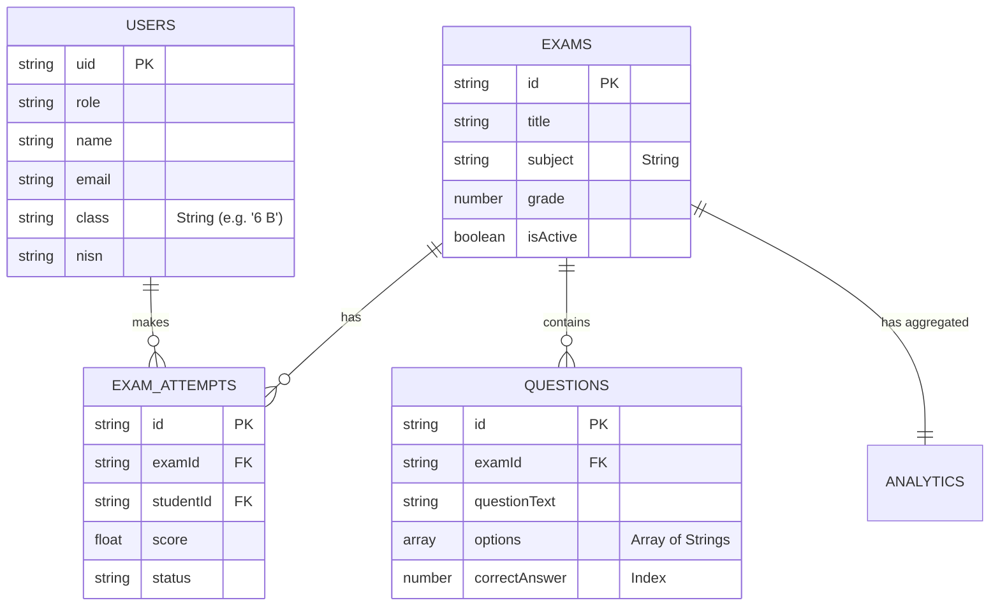

# Database Design - Ujian Online System (Current State)

## 1. Architecture Overview

**Database Engine**: Google Cloud Firestore (NoSQL)
**Pattern**: Collection-based.
**Current State**: As of 2025-11-27.

---

## 2. Entity-Relationship Diagram (ERD)



---

## 3. Detailed Collection Schemas

### 3.1. Collection: `users`
Stores all user data (students and admins).

| Field | Type | Required | Description |
|-------|------|----------|-------------|
| `uid` | string | ✅ | Firebase Auth UID (Document ID) |
| `name` | string | ✅ | Full name (e.g., "Zahra Micheila Putri") |
| `email` | string | ✅ | Email (e.g., "zahra.4229@students.pppl.id") |
| `role` | string | ✅ | `student`, `admin` |
| `isActive` | boolean | ✅ | Account status |
| `createdAt` | timestamp | ✅ | |
| `updatedAt` | timestamp | ✅ | |
| **Student Specific** | | | |
| `nisn` | string | ❌ | NISN (e.g., "0134894229") |
| `class` | string | ❌ | Class name (e.g., "6 B") |

**JSON Example:**
```json
{
  "uid": "1lM04c4F1JfN0m0RI9jmLyzPBPJ2",
  "name": "Zahra Micheila Putri",
  "email": "zahra.4229@students.pppl.id",
  "nisn": "0134894229",
  "class": "6 B",
  "role": "student",
  "isActive": true,
  "createdAt": "Timestamp",
  "updatedAt": "Timestamp"
}
```

---

### 3.2. Collection: `exams`
Exam metadata.

| Field | Type | Required | Description |
|-------|------|----------|-------------|
| `id` | string | ✅ | Auto-ID |
| `title` | string | ✅ | Exam title |
| `description` | string | ❌ | |
| `subject` | string | ✅ | Subject name (e.g., "Bahasa Indonesia") |
| `grade` | number | ✅ | Target grade (e.g., 6) |
| `duration` | number | ✅ | Duration in minutes |
| `totalQuestions` | number | ✅ | Total questions count |
| `passingScore` | number | ✅ | Minimum score to pass |
| `isActive` | boolean | ✅ | |
| `createdBy` | string | ✅ | Admin UID |
| `createdAt` | timestamp | ✅ | |
| `updatedAt` | timestamp | ✅ | |
| `scheduledDate` | timestamp | ❌ | Optional |

**JSON Example:**
```json
{
  "id": "exam_123",
  "title": "Ujian Bahasa Indonesia",
  "subject": "Bahasa Indonesia",
  "grade": 6,
  "duration": 90,
  "totalQuestions": 40,
  "passingScore": 70,
  "isActive": true,
  "createdBy": "admin_uid",
  "createdAt": "Timestamp"
}
```

---

### 3.3. Collection: `questions`
Individual questions linked to exams.

| Field | Type | Required | Description |
|-------|------|----------|-------------|
| `id` | string | ✅ | Auto-ID |
| `examId` | string | ✅ | Reference to `exams` |
| `questionText` | string | ✅ | The question |
| `questionNumber` | number | ✅ | Order |
| `options` | array | ✅ | Array of 4 strings |
| `correctAnswer` | number | ✅ | Index of correct answer (0-3) |
| `subject` | string | ✅ | Subject name |
| `difficulty` | string | ❌ | `mudah`, `sedang`, `sukar` |
| `explanation` | string | ❌ | |
| `createdAt` | timestamp | ✅ | |

**JSON Example:**
```json
{
  "id": "q_123",
  "examId": "exam_123",
  "questionText": "Apa antonim dari...",
  "questionNumber": 1,
  "options": ["A", "B", "C", "D"],
  "correctAnswer": 2,
  "subject": "Bahasa Indonesia",
  "difficulty": "sedang",
  "createdAt": "Timestamp"
}
```

---

### 3.4. Collection: `examAttempts`
Student submissions.

| Field | Type | Required | Description |
|-------|------|----------|-------------|
| `id` | string | ✅ | Auto-ID |
| `examId` | string | ✅ | Reference to `exams` |
| `examTitle` | string | ✅ | Denormalized title |
| `studentId` | string | ✅ | Reference to `users` |
| `studentName` | string | ✅ | Denormalized name |
| `studentClass` | string | ✅ | Denormalized class |
| `answers` | map | ✅ | `{ questionId: answerIndex }` |
| `score` | number | ✅ | 0-100 |
| `totalQuestions` | number | ✅ | |
| `correctAnswers` | number | ✅ | |
| `incorrectAnswers` | number | ✅ | |
| `unanswered` | number | ✅ | |
| `timeSpent` | number | ✅ | Seconds |
| `isPassed` | boolean | ✅ | |
| `status` | string | ✅ | `completed`, `abandoned` |
| `startedAt` | timestamp | ✅ | |
| `submittedAt` | timestamp | ✅ | |

---

### 3.5. Collection: `analytics`
Aggregated stats.

| Field | Type | Required | Description |
|-------|------|----------|-------------|
| `id` | string | ✅ | Usually `analytics_{examId}` |
| `examId` | string | ✅ | |
| `totalAttempts` | number | ✅ | |
| `averageScore` | number | ✅ | |
| `passRate` | number | ✅ | |
| `questionStats` | array | ✅ | List of stats per question |
| `classStats` | map | ✅ | Stats grouped by class string |
| `lastUpdated` | timestamp | ✅ | |

---

### 3.6. Collection: `settings`
System configuration.

**Document: `config`**
| Field | Type | Description |
|-------|------|-------------|
| `schoolName` | string | e.g. "SDN Pasir Gunung Selatan 1" |
| `schoolAddress` | string | |
| `academicYear` | string | e.g. "2024/2025" |
| `maintenanceMode` | boolean | |
| `geminiApiKey` | string | |
| `updatedAt` | timestamp | |

---

## 4. Security Rules (Inferred)

1.  **Users**: Read own profile. Admin reads all.
2.  **Exams**: Read active exams. Admin writes.
3.  **Questions**: Read if taking exam. Admin writes.
4.  **ExamAttempts**: Create/Read own. Admin reads all.
