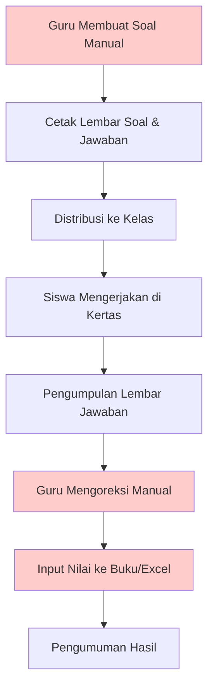
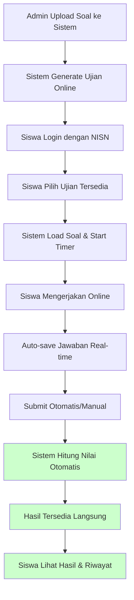
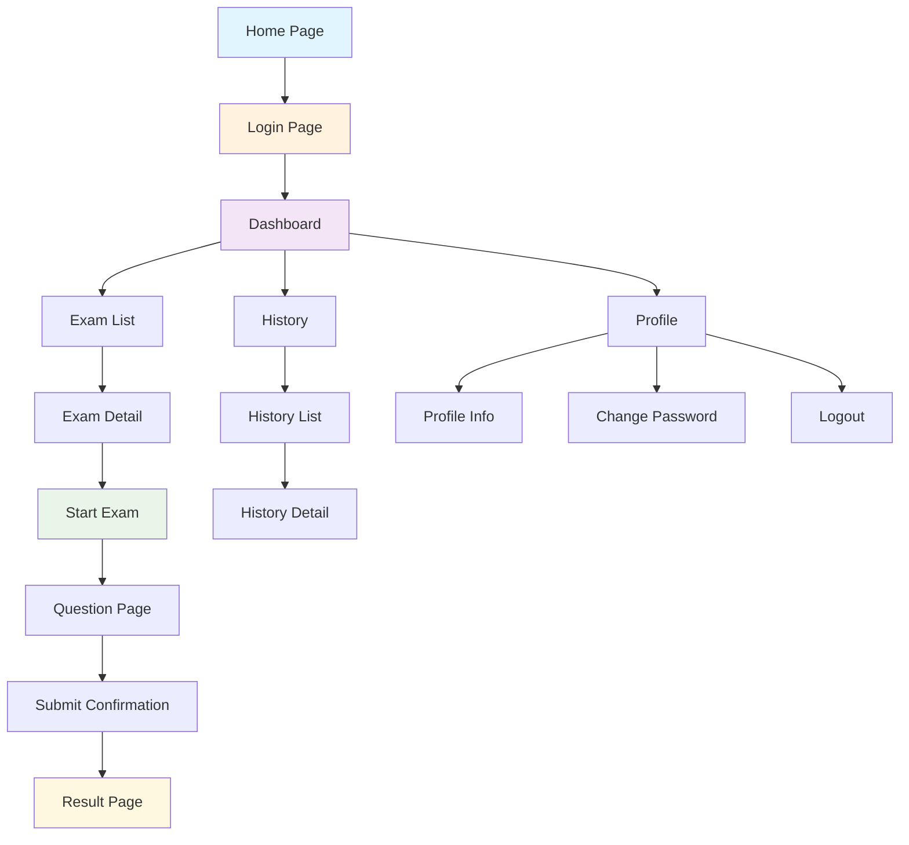
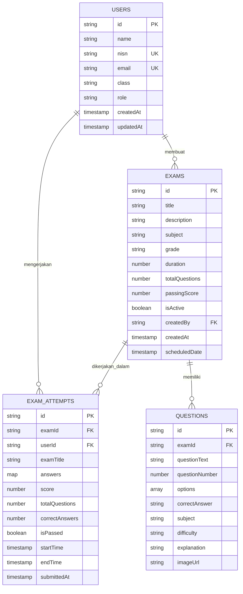
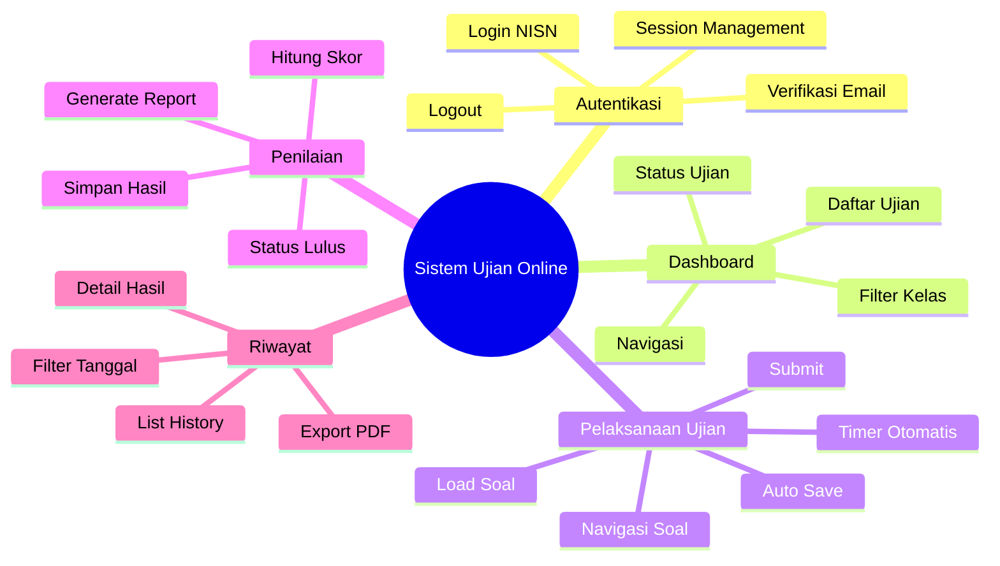
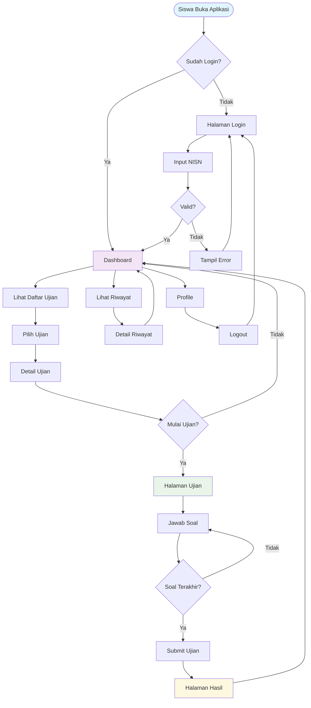
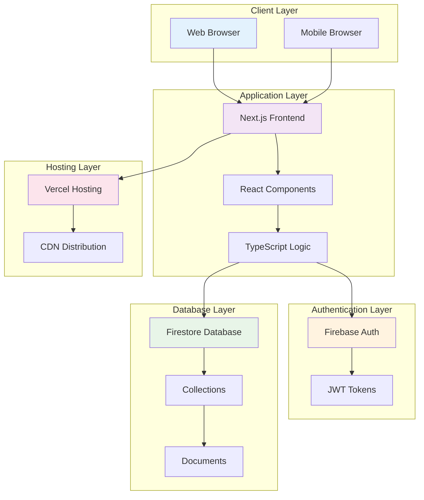
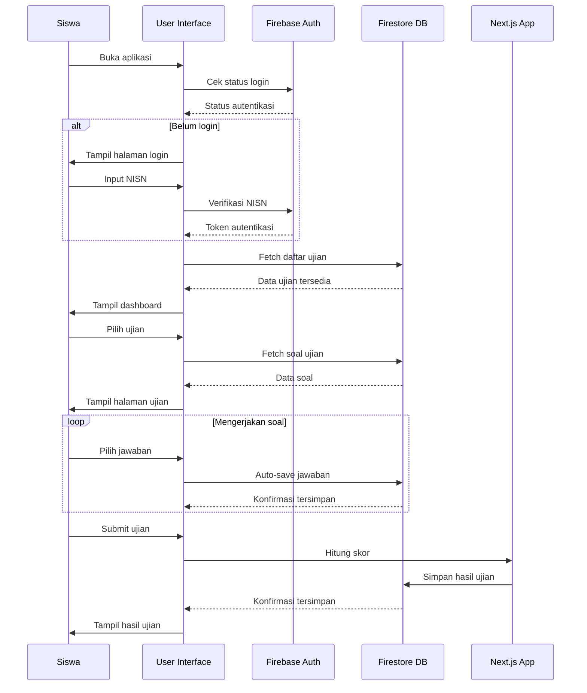

# Business Requirements Document (BRD)

## Sistem Ujian Online - SDN TUGU 1

---

## Table of Content

1. [Table of Content](#table-of-content) ​ 2
2. [Version Control](#version-control) ​ 3
3. [Introduction](#1-introduction) ​ 4
   - 3.1 [Project Summary](#11-project-summary) ​ 4
     - 3.1.1 [Background](#111-background) ​ 4
     - 3.1.2 [Objective & Benefits](#112-objective--benefits) ​ 4
   - 3.2 [Project Scope](#12-project-scope) ​ 5
     - 3.2.1 [In Scope Functionality](#121-in-scope-functionality) ​ 5
     - 3.2.2 [Out Scope Functionality](#122-out-scope-functionality) ​ 5
4. [Business Process Overview](#2-business-process-overview) ​ 6
   - 4.1 [Current Business Process (As-Is)](#21-current-business-process-as-is) ​ 6
   - 4.2 [Proposed Business Process (To-Be)](#22-proposed-business-process-to-be) ​ 6
   - 4.3 [Business Rule](#23-business-rule) ​ 7
5. [Attachment](#3-attachment) ​ 7
   - 5.1 [List of Acronyms](#31-list-of-acronyms) ​ 7
   - 5.2 [Related Documents](#32-related-documents) ​ 8
   - 5.3 [Mindmap or Sitemap](#33-mindmap-or-sitemap) ​ 8
   - 5.4 [Design](#34-design) ​ 8

---

## Version Control

| Versi | Tanggal | Penulis | Email | Changelog |
|-------|---------|---------|-------|-----------|
| 1.0 | 2024-01-15 | Tim Business Analyst | ba@sdntugu1.sch.id | Dokumen awal BRD Sistem Ujian Online |
| 1.1 | 2024-01-20 | Tim Business Analyst | ba@sdntugu1.sch.id | Penambahan business process dan database relations |
| 1.2 | 2024-01-25 | Tim Business Analyst | ba@sdntugu1.sch.id | Revisi scope dan business rules |

---

## 1. Introduction

### 1.1 Project Summary

#### 1.1.1 Background

SDN TUGU 1 saat ini masih menggunakan sistem ujian konvensional berbasis kertas yang memiliki beberapa keterbatasan:

- **Proses Manual**: Pembuatan soal, distribusi, dan penilaian masih dilakukan secara manual
- **Waktu Penilaian Lama**: Guru membutuhkan waktu berhari-hari untuk mengoreksi hasil ujian
- **Risiko Kehilangan Data**: Lembar jawaban fisik rentan hilang atau rusak
- **Keterbatasan Monitoring**: Sulit memantau progress siswa secara real-time
- **Biaya Operasional Tinggi**: Biaya cetak kertas dan logistik distribusi soal
- **Kesulitan Analisis**: Sulit menganalisis pola jawaban dan tingkat kesulitan soal

Dengan perkembangan teknologi digital dan kebutuhan modernisasi pendidikan, SDN TUGU 1 memerlukan sistem ujian online yang dapat mengatasi permasalahan tersebut dan meningkatkan efisiensi proses evaluasi pembelajaran.

#### 1.1.2 Objective & Benefits

**Tujuan Utama:**
1. **Digitalisasi Proses Ujian**: Mengubah sistem ujian dari manual ke digital
2. **Otomatisasi Penilaian**: Sistem penilaian otomatis untuk efisiensi waktu
3. **Peningkatan Akurasi**: Mengurangi human error dalam proses penilaian
4. **Real-time Monitoring**: Memantau progress ujian secara langsung
5. **Data Analytics**: Menganalisis performa siswa dan efektivitas soal

**Manfaat yang Diharapkan:**

**Untuk Siswa:**
- Pengalaman ujian yang lebih modern dan interaktif
- Hasil ujian tersedia segera setelah selesai
- Akses riwayat ujian untuk evaluasi diri
- Interface yang user-friendly dan responsif

**Untuk Guru:**
- Penghematan waktu dalam proses penilaian (dari 2-3 hari menjadi real-time)
- Kemudahan dalam membuat dan mengelola soal ujian
- Analisis mendalam tentang performa siswa
- Monitoring real-time selama ujian berlangsung

**Untuk Sekolah:**
- Penghematan biaya operasional (kertas, tinta, logistik)
- Peningkatan efisiensi administrasi ujian
- Data terpusat dan aman
- Pelaporan otomatis untuk evaluasi kurikulum

### 1.2 Project Scope

#### 1.2.1 In Scope Functionality

**Modul Autentikasi:**
- Login siswa menggunakan NISN
- Verifikasi identitas melalui Firebase Authentication
- Session management dan auto-logout
- Password reset functionality

**Modul Dashboard:**
- Dashboard siswa dengan daftar ujian tersedia
- Informasi detail ujian (mata pelajaran, durasi, jumlah soal)
- Status ujian (belum dimulai, sedang berlangsung, selesai)
- Navigasi ke modul ujian dan riwayat

**Modul Pelaksanaan Ujian:**
- Interface pengerjaan soal dengan timer otomatis
- Navigasi antar soal (previous/next)
- Auto-save jawaban secara real-time
- Submit otomatis ketika waktu habis
- Konfirmasi submit manual

**Modul Penilaian:**
- Penilaian otomatis berdasarkan kunci jawaban
- Perhitungan skor dan persentase
- Penentuan status kelulusan
- Penyimpanan hasil ke database

**Modul Hasil dan Riwayat:**
- Tampilan hasil ujian dengan detail skor
- Riwayat semua ujian yang pernah dikerjakan
- Filter dan pencarian riwayat ujian
- Export hasil ujian (PDF)

**Modul Database:**
- Penyimpanan data siswa, ujian, soal, dan hasil
- Backup otomatis data
- Data integrity dan validation
- Audit trail untuk tracking perubahan

#### 1.2.2 Out Scope Functionality

**Fitur yang Tidak Termasuk dalam Scope:**
- **Modul Admin/Guru**: Pembuatan dan pengelolaan soal ujian
- **Sistem Notifikasi**: Email/SMS notification untuk ujian
- **Video Proctoring**: Monitoring melalui webcam
- **Advanced Analytics**: Dashboard analytics untuk guru/admin
- **Multi-language Support**: Hanya mendukung Bahasa Indonesia
- **Mobile Application**: Hanya web-based application
- **Integration dengan LMS**: Integrasi dengan Learning Management System lain
- **Plagiarism Detection**: Deteksi kecurangan atau plagiarisme
- **Question Bank Management**: Pengelolaan bank soal yang kompleks
- **Scheduling System**: Penjadwalan ujian otomatis

---

## 2. Business Process Overview

### 2.1 Current Business Process (As-Is)

**Permasalahan Proses Saat Ini:**
- **Waktu Koreksi Lama**: 2-3 hari untuk mengoreksi satu kelas
- **Risiko Human Error**: Kesalahan dalam penghitungan nilai
- **Biaya Tinggi**: Cetak kertas dan logistik
- **Penyimpanan Fisik**: Membutuhkan ruang penyimpanan besar
- **Sulit Dianalisis**: Data tidak terstruktur untuk analisis

### 2.2 Proposed Business Process (To-Be)

**Keunggulan Proses Baru:**
- **Penilaian Instan**: Hasil tersedia segera setelah submit
- **Zero Human Error**: Penilaian 100% akurat
- **Paperless**: Tidak membutuhkan kertas
- **Data Terstruktur**: Mudah untuk analisis dan pelaporan
- **Real-time Monitoring**: Pantau progress ujian langsung

### 2.3 Business Rule

#### Aturan Autentikasi
1. **BR-AUTH-001**: Siswa hanya dapat login menggunakan NISN yang terdaftar
2. **BR-AUTH-002**: Format email otomatis: `{nisn}@sdntugu1.sch.id`
3. **BR-AUTH-003**: Session timeout setelah 2 jam tidak aktif
4. **BR-AUTH-004**: Maksimal 3 kali percobaan login gagal

#### Aturan Ujian
5. **BR-EXAM-001**: Siswa hanya dapat mengakses ujian yang sesuai dengan kelasnya
6. **BR-EXAM-002**: Ujian hanya dapat diakses dalam rentang waktu yang ditentukan
7. **BR-EXAM-003**: Satu siswa hanya dapat mengerjakan ujian yang sama sekali
8. **BR-EXAM-004**: Timer ujian tidak dapat dihentikan atau direset
9. **BR-EXAM-005**: Jawaban tersimpan otomatis setiap 30 detik
10. **BR-EXAM-006**: Submit otomatis ketika waktu habis

#### Aturan Penilaian
11. **BR-SCORE-001**: Skor = (Jawaban Benar / Total Soal) × 100
12. **BR-SCORE-002**: Status LULUS jika skor ≥ passing score ujian
13. **BR-SCORE-003**: Hasil ujian tidak dapat diubah setelah submit
14. **BR-SCORE-004**: Semua soal harus dijawab untuk mendapat nilai penuh

#### Aturan Data
15. **BR-DATA-001**: Data ujian disimpan selama minimal 1 tahun
16. **BR-DATA-002**: Backup data dilakukan setiap hari
17. **BR-DATA-003**: Akses data hanya untuk user yang berwenang
18. **BR-DATA-004**: Log aktivitas disimpan untuk audit trail

---

## 3. Attachment

### 3.1 List of Acronyms

| Acronym | Kepanjangan | Deskripsi |
|---------|-------------|-----------|
| BRD | Business Requirements Document | Dokumen kebutuhan bisnis |
| FSD | Functional Specification Document | Dokumen spesifikasi fungsional |
| NISN | Nomor Induk Siswa Nasional | Identitas unik siswa |
| UI | User Interface | Antarmuka pengguna |
| UX | User Experience | Pengalaman pengguna |
| API | Application Programming Interface | Interface pemrograman aplikasi |
| DB | Database | Basis data |
| CRUD | Create, Read, Update, Delete | Operasi dasar database |
| JSON | JavaScript Object Notation | Format pertukaran data |
| HTTP | HyperText Transfer Protocol | Protokol transfer data web |
| HTTPS | HTTP Secure | HTTP dengan enkripsi |
| CSS | Cascading Style Sheets | Bahasa styling web |
| HTML | HyperText Markup Language | Bahasa markup web |
| JS | JavaScript | Bahasa pemrograman web |
| TS | TypeScript | JavaScript dengan type safety |
| PWA | Progressive Web Application | Aplikasi web progresif |

### 3.2 Related Documents

| No | Nama Dokumen | Versi | Tanggal | Deskripsi |
|----|--------------|-------|---------|-----------|
| 1 | FSD_SISTEM_UJIAN_ONLINE.md | 1.0 | 2024-01-15 | Functional Specification Document |
| 2 | ARSITEKTUR_SISTEM.md | 1.0 | 2024-01-10 | Dokumentasi arsitektur sistem |
| 3 | DATABASE.md | 1.0 | 2024-01-08 | Dokumentasi struktur database |
| 4 | FIREBASE_STRUCTURE.md | 1.0 | 2024-01-08 | Struktur Firebase Firestore |
| 5 | PROJECT_STRUCTURE.md | 1.0 | 2024-01-08 | Struktur proyek aplikasi |
| 6 | SECURITY_CHECKLIST.md | 1.0 | 2024-01-12 | Checklist keamanan sistem |
| 7 | README.md | 1.0 | 2024-01-05 | Panduan instalasi dan setup |

### 3.3 Mindmap or Sitemap

#### Sitemap Aplikasi

#### Database Relationship Diagram

#### Business Process Mindmap

### 3.4 Design

#### User Flow Diagram

#### System Architecture Overview

#### Data Flow Architecture

---

**Dokumen ini telah direview dan disetujui oleh:**

**Business Analyst:**
_________________________
Nama: [Nama BA]
Tanggal: _______________

**Project Manager:**
_________________________
Nama: [Nama PM]
Tanggal: _______________

**Stakeholder (Kepala Sekolah):**
_________________________
Nama: Drs. Ahmad Suryadi, M.Pd
Tanggal: _______________