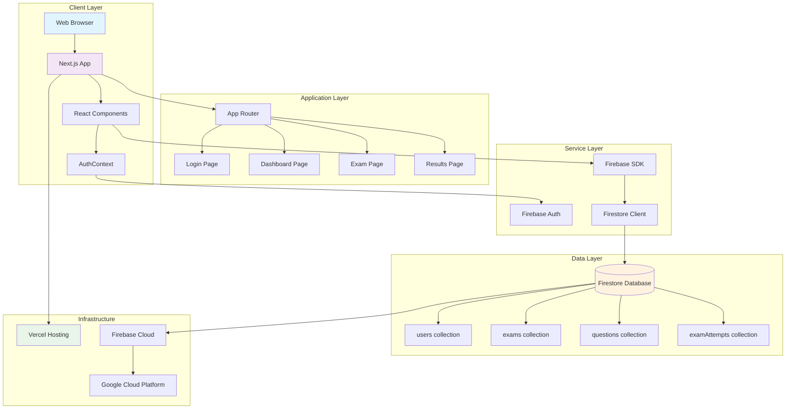
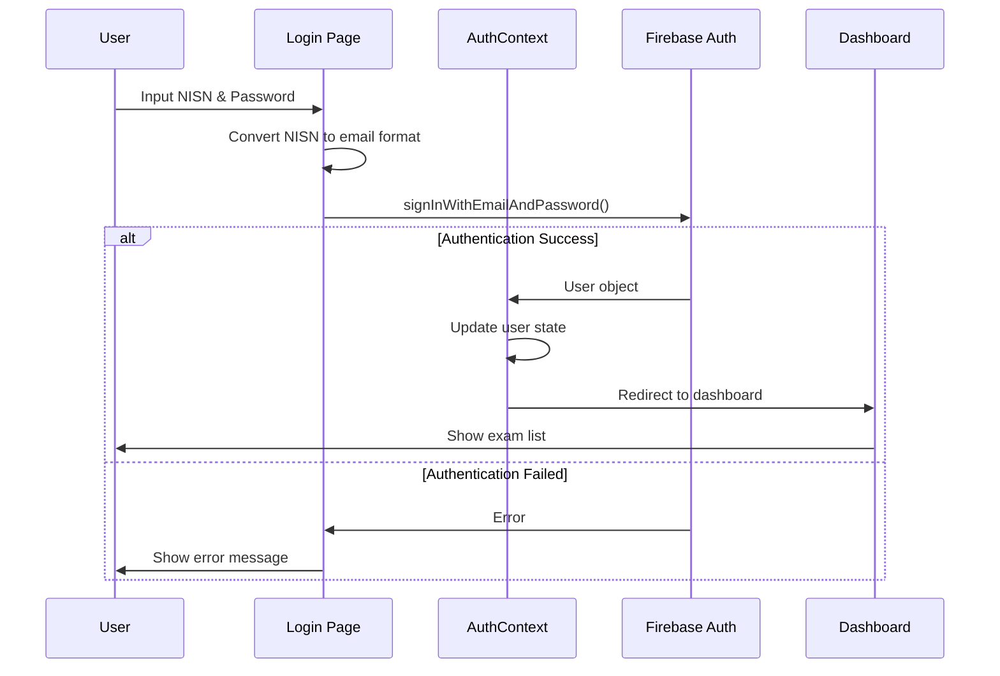
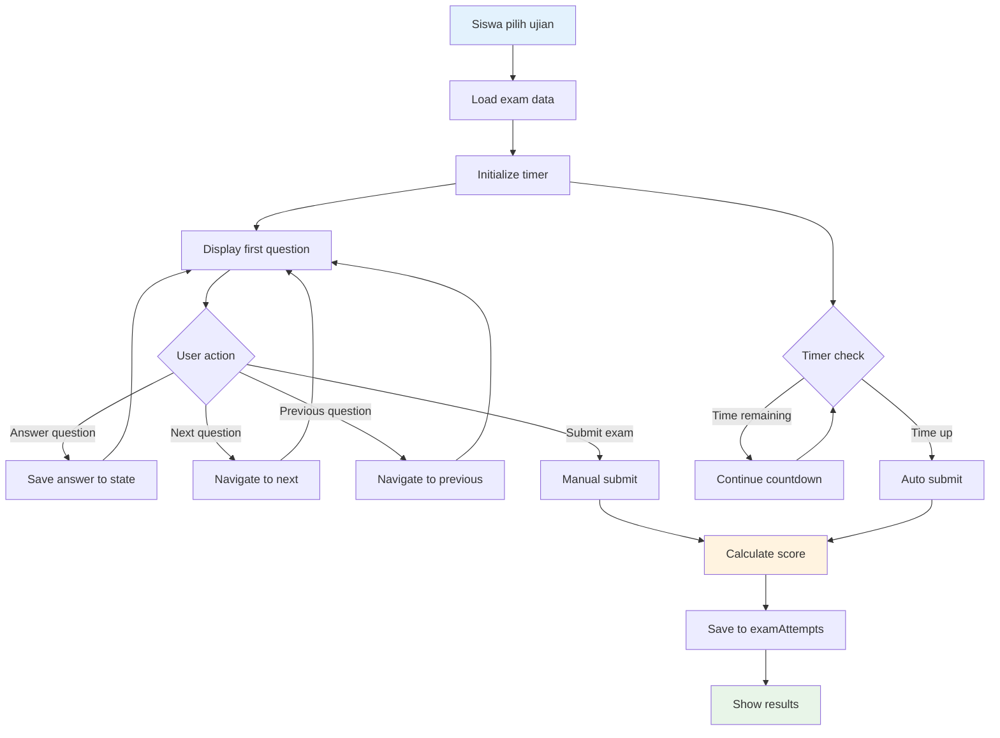
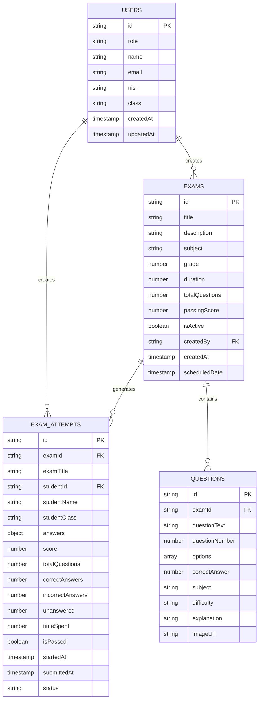
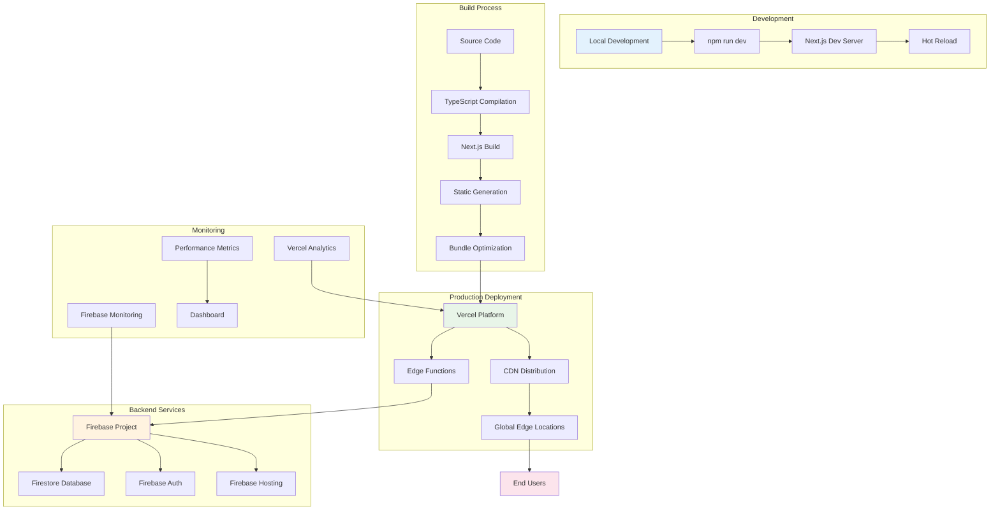
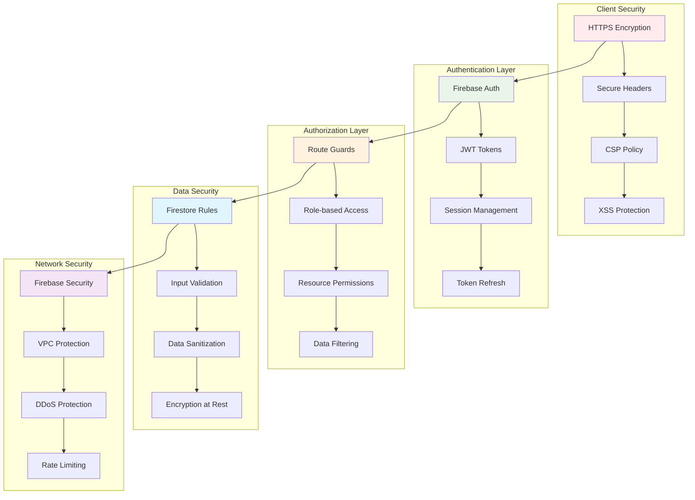
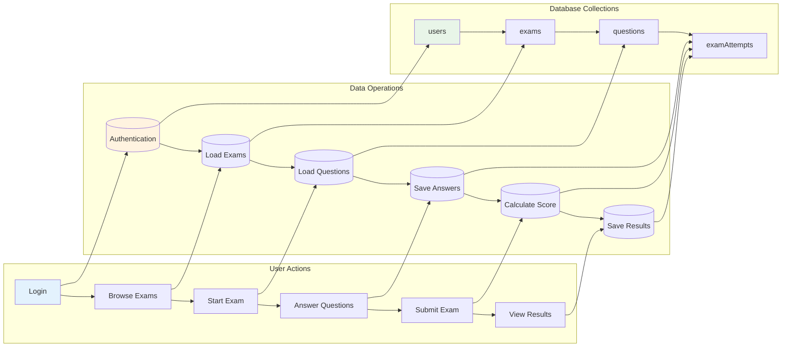
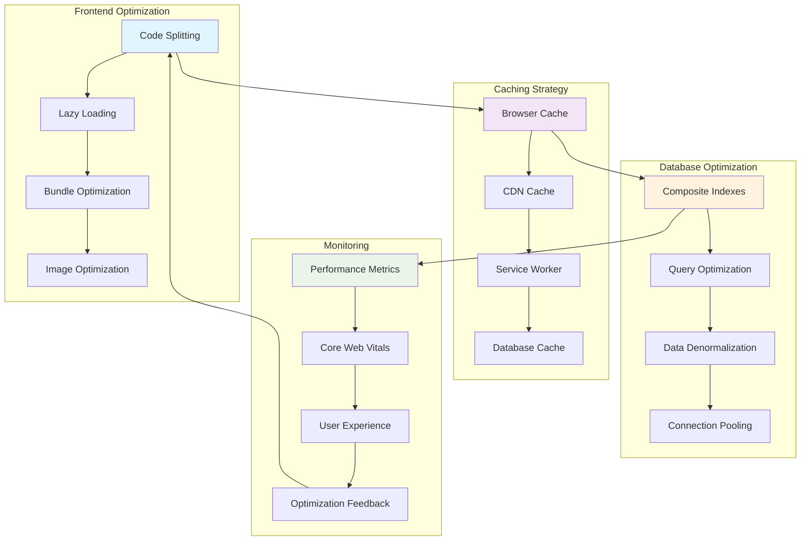
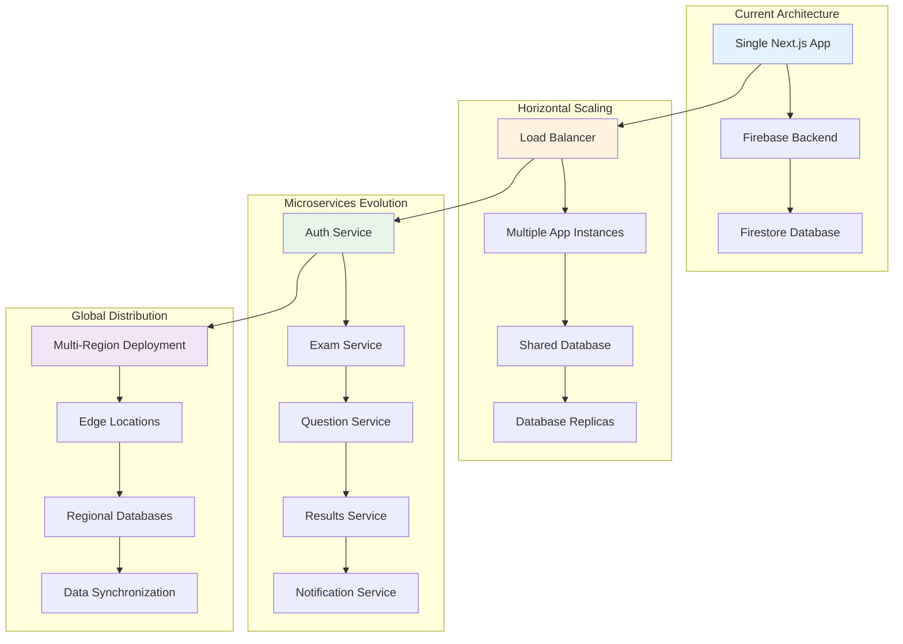

# Diagram Arsitektur Sistem Ujian Online - SDN TUGU 1

## 1. Diagram Arsitektur Sistem Keseluruhan



## 2. Diagram Flow Autentikasi



## 3. Diagram Flow Pengerjaan Ujian



## 4. Diagram Database Schema



## 5. Diagram Komponen Aplikasi

```mermaid
graph TD
    subgraph "Root Layout"
        A[layout.tsx] --> B[AuthProvider]
        A --> C[Global CSS]
    end
    
    subgraph "Pages"
        D[page.tsx - Root] --> E[Redirect Logic]
        F[login/page.tsx] --> G[Login Form]
        H[dashboard/page.tsx] --> I[Exam List]
        J[exam/[id]/page.tsx] --> K[Exam Interface]
        L[results/page.tsx] --> M[Results List]
        N[results/[id]/page.tsx] --> O[Result Detail]
    end
    
    subgraph "Lib Components"
        P[AuthContext.tsx] --> Q[Auth State Management]
        R[firebase.ts] --> S[Firebase Config]
        T[types.ts] --> U[TypeScript Interfaces]
    end
    
    subgraph "Hooks & Utils"
        V[useAuth Hook] --> P
        W[Firebase Services] --> R
    end
    
    B --> P
    G --> R
    I --> R
    K --> R
    M --> R
    O --> R
    
    style A fill:#e1f5fe
    style P fill:#f3e5f5
    style R fill:#fff3e0
```

## 6. Diagram Deployment Architecture



## 7. Diagram Security Architecture



## 8. Diagram Data Flow



## 9. Diagram Performance Optimization



## 10. Diagram Scalability Architecture



---

## Cara Menggunakan Diagram

### Format Mermaid
Diagram-diagram di atas menggunakan format Mermaid yang dapat di-render di:
- GitHub (otomatis)
- GitLab (otomatis)
- VS Code dengan extension Mermaid
- Online editor: https://mermaid.live/

### Export ke Format Lain
Untuk mengkonversi ke format lain:
1. **PNG/SVG**: Gunakan Mermaid CLI atau online editor
2. **PDF**: Export dari browser setelah render
3. **Draw.io**: Import Mermaid syntax
4. **Visio**: Manual recreation berdasarkan diagram

### Penggunaan dalam Presentasi
- Gunakan diagram 1-3 untuk overview sistem
- Diagram 4 untuk penjelasan database
- Diagram 5-6 untuk technical implementation
- Diagram 7-8 untuk security dan performance
- Diagram 9-10 untuk future planning

---

**Catatan**: Diagram ini melengkapi dokumentasi arsitektur dan dapat digunakan untuk presentasi, analisis sistem, atau sebagai referensi pengembangan.